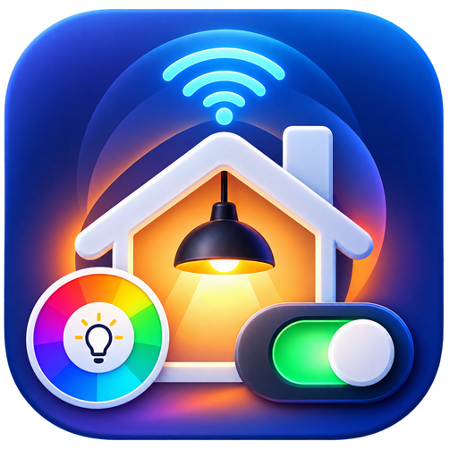
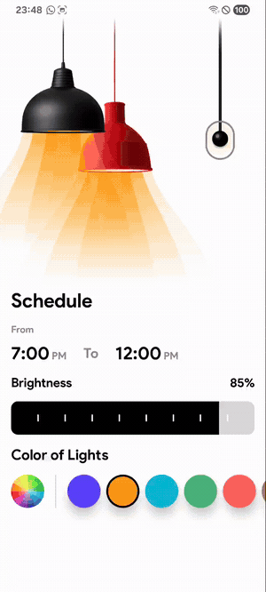
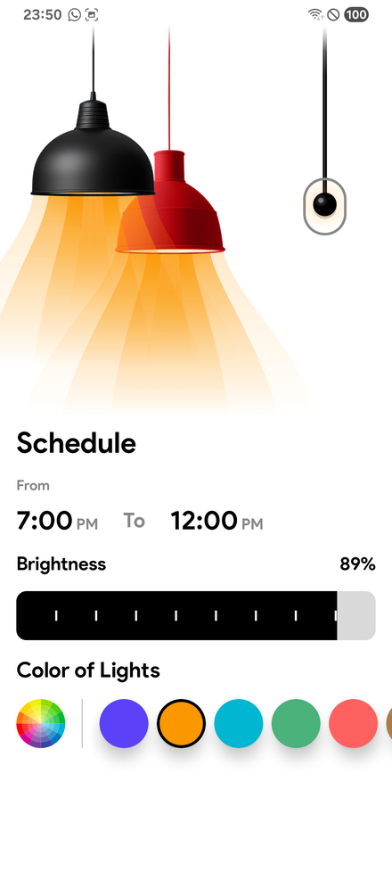
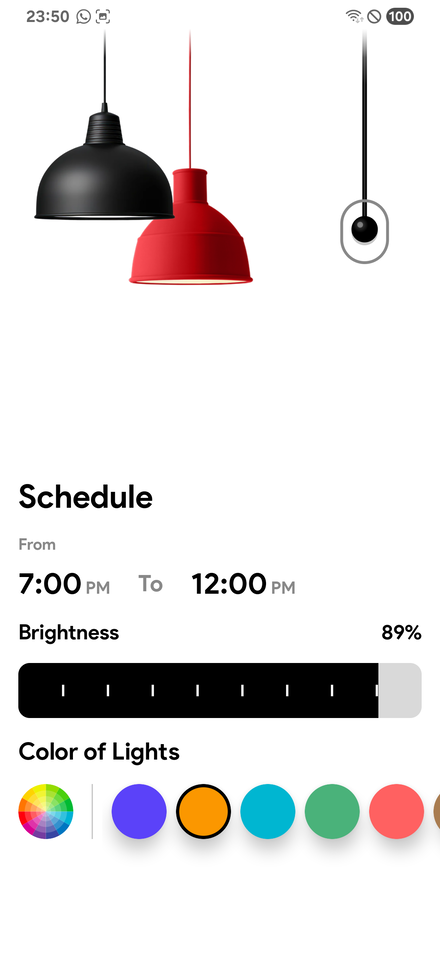
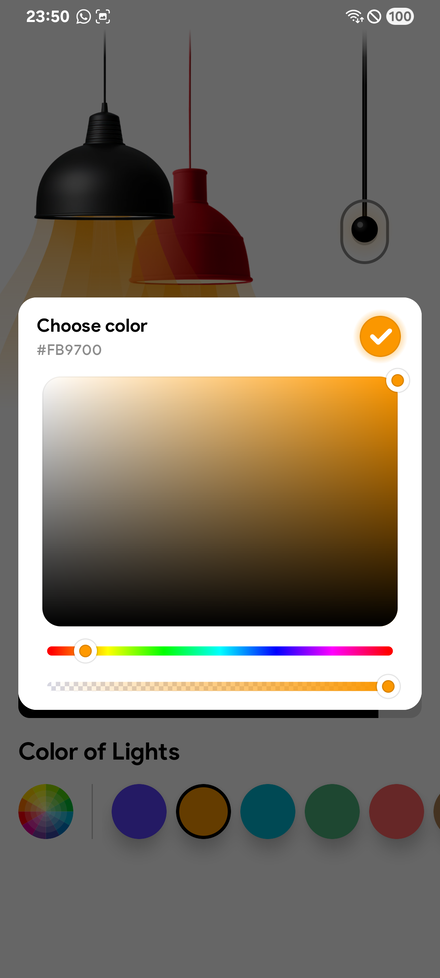

<div align="center">



# Smart Home

**A Jetpack Compose playground that turns a phone into a light controller.**

Pull the rope to switch the lamps on, drag the seekbar to dim them, and pick any colour you like —
every beam, switch and slider is drawn from scratch on a Compose `Canvas`.

[](https://kotlinlang.org)
[](https://developer.android.com/jetpack/compose)
[](https://m3.material.io)
[](https://insert-koin.io)
[](https://developer.android.com/tools/releases/platforms)
[](https://developer.android.com/build)

[Demo](#-demo) &nbsp;·&nbsp; [Features](#-features) &nbsp;·&nbsp; [Tech Stack](#-tech-stack) &nbsp;·&nbsp; [Architecture](#-architecture) &nbsp;·&nbsp; [Project Structure](#-project-structure) &nbsp;·&nbsp; [Getting Started](#-getting-started)

</div>

---

## 📑 Table of Contents

- [Demo](#-demo)
- [Screenshots](#-screenshots)
- [Features](#-features)
- [Tech Stack](#-tech-stack)
- [Architecture](#-architecture)
- [Project Structure](#-project-structure)
- [Custom Compose Components](#-custom-compose-components)
- [Getting Started](#-getting-started)
- [Roadmap](#-roadmap)
- [Author](#-author)

---

## 🎬 Demo

<div align="center">



<sub>Recorded on a physical device — Samsung Galaxy A05s (SM-A057F), Android 15.</sub><br/>
<sub>▶️ <a href="docs/preview.mp4">Watch the full-quality MP4</a></sub>

</div>

The clip walks through the whole interaction loop:

| # | Moment | What happens |
|---|--------|--------------|
| 1 | **Rope pull** | A drag gesture on the rope releases with spring physics and toggles the lamps |
| 2 | **Lights off / on** | The volumetric beams fade out and back in |
| 3 | **Brightness sweep** | Dragging the seekbar drives the beam opacity in real time (20% → 89%) |
| 4 | **Preset colours** | Tapping a swatch cross-fades the beam colour over 500 ms |
| 5 | **Custom colour** | The HSV dialog picks any colour, live-previewing the hex value |
| 6 | **Persistence** | Every change is debounced and written to DataStore, so it survives a restart |

---

## 📸 Screenshots

<div align="center">
<table>
  <tr>
    <td align="center"></td>
    <td align="center"></td>
    <td align="center"></td>
  </tr>
  <tr>
    <td align="center"><b>Lights on</b><br/><sub>Beams tinted by the active colour</sub></td>
    <td align="center"><b>Lights off</b><br/><sub>Rope switch released</sub></td>
    <td align="center"><b>Custom colour</b><br/><sub>HSV picker with live hex</sub></td>
  </tr>
</table>
</div>

---

## ✨ Features

- 💡 **Rope switch with real physics** — a draggable rope built on `Canvas` + `Animatable`, with spring-back release, lateral sway and a recoil wave that travels back up the cord.
- 🔦 **Volumetric light beams** — layered cone gradients drawn per-lamp, reacting to both colour and brightness.
- 🎚️ **Custom brightness seekbar** — a tick-marked track drawn from scratch, driven by tap and horizontal-drag gestures with immediate state feedback.
- 🎨 **Colour presets** — a `LazyRow` of swatches with a selected-state ring, animated colour cross-fade (`animateColorAsState`, 500 ms).
- 🌈 **Full HSV colour picker** — a Compose dialog combining a saturation/value field, hue slider and alpha slider from [`ColorPickerView`](https://github.com/mihphu/ColorPickerView), with a live hex readout and an auto-contrasting confirm button.
- 💾 **Config that survives restarts** — light state, ARGB colour and brightness are persisted in **Preferences DataStore**.
- ⏱️ **Debounced writes** — UI updates are instant, disk writes are debounced by 300 ms on an application-scoped `CoroutineScope`, so a rapid drag never floods the disk and an in-flight write is never cancelled by `ViewModel` teardown.
- 🧩 **Unidirectional data flow** — a single immutable `UiState` in, a sealed `Event` hierarchy out.
- 📱 **Edge-to-edge UI** — hidden navigation bar with transient swipe reveal, light status-bar icons.
- 🔤 **Custom typography** — the full Product Sans family wired into a Compose `FontFamily`.
- 🧪 **StrictMode in debug** — disk/network violations on the main thread are flagged during development only.

---

## 🛠 Tech Stack

### Language & Build

| Tool | Version | Notes |
|------|---------|-------|
| Kotlin | `2.4.10` | with the Compose compiler plugin |
| Android Gradle Plugin | `9.3.2` | Gradle **version catalog** (`gradle/libs.versions.toml`) |
| Java target | `11` | `sourceCompatibility` / `targetCompatibility` |
| compileSdk / targetSdk | `37` | Android 17 |
| minSdk | `24` | Android 7.0 Nougat |
| Toolchain | Foojay resolver `1.0.0` | auto-provisions the JDK |

### Libraries

| Area | Library | Version |
|------|---------|---------|
| **UI** | Jetpack Compose (BOM) | `2026.08.00` |
| | Compose Material 3 | via BOM |
| | Compose UI / UI-Graphics / Tooling | via BOM |
| | Activity Compose | `1.13.0` |
| **DI** | Koin (BOM, `core`, `android`, `compose`, `compose-viewmodel`) | `4.2.2` |
| **Async** | kotlinx-coroutines (`core`, `android`) | `1.11.0` |
| **Lifecycle** | `lifecycle-viewmodel-ktx` / `-compose` / `-savedstate` | `2.11.0` |
| | `lifecycle-runtime-compose` (`collectAsStateWithLifecycle`) | `2.11.0` |
| **Storage** | AndroidX DataStore Preferences | `1.2.1` |
| **Colour** | [`ColorPickerView` (Compose)](https://github.com/mihphu/ColorPickerView) | `1.1.1` |
| **Core** | AndroidX Core KTX | `1.19.0` |
| **Test** | JUnit 4 · AndroidX JUnit · Espresso · Compose UI Test | `4.13.2` / `1.3.0` / `3.7.0` |

---

## 🏗 Architecture

The app follows a pragmatic **Clean Architecture + MVVM** split with a strict one-way dependency rule:
`presentation` → `domain` ← `data`. The domain layer knows nothing about Android storage, and the
UI only ever talks to an interface.

```
┌──────────────────────────── PRESENTATION ────────────────────────────┐
│  LightScreen (Composable)                                            │
│      │  collectAsStateWithLifecycle()          onEvent(Event)        │
│      ▼                                              │                │
│  LightScreenViewModel ── StateFlow<LightScreenUiState> ──┘           │
└───────────────────────────────┬──────────────────────────────────────┘
                                │  LightRepository (interface)
┌───────────────────────────── DOMAIN ─────────────────────────────────┐
│  Config (model)            LightRepository (contract)                │
└───────────────────────────────┬──────────────────────────────────────┘
                                │  implemented by
┌────────────────────────────── DATA ──────────────────────────────────┐
│  LightRepositoryImpl ──▶ LightConfig ──▶ LightConfigImpl             │
│                                              │                       │
│                                     Preferences DataStore            │
│                                     ("light_config")                 │
└──────────────────────────────────────────────────────────────────────┘
```

### Unidirectional data flow

```
User gesture ─▶ LightScreenEvent ─▶ ViewModel.onEvent()
                                         │
                         ┌───────────────┴───────────────┐
                         ▼                               ▼
              _uiState.update { … }            scheduleSave()  (300 ms debounce,
                         │                                      externalScope)
                         ▼                                      │
              StateFlow<LightScreenUiState>                      ▼
                         │                          repo.applyLightConfig(Config)
                         ▼                                      │
                   Recomposition                                ▼
                                                        DataStore.edit { … }
```

**Why an external scope?** Persisting is a *fire-and-forget* operation that must not die with the
screen. `LightScreenViewModel` receives an application-scoped `CoroutineScope`
(`SupervisorJob() + Dispatchers.Default`, provided by `appModule`) so the last debounced write always
completes, even if the `ViewModel` is cleared mid-flight.

### Dependency injection (Koin)

| Module | Provides |
|--------|----------|
| `appModule` | `SmartHomeApplication`, application-scoped `CoroutineScope` |
| `datastoreModule` | `LightConfig` → `LightConfigImpl(androidContext())` |
| `repositoryModule` | `LightRepository` → `LightRepositoryImpl` |
| `viewModelModule` | `LightScreenViewModel` |

All four are started in `SmartHomeApplication.onCreate()` via `startKoin { … }`, and the screen
resolves its ViewModel with `koinViewModel()`.

---

## 📂 Project Structure

```
app/src/main/java/com/compose/smarthome/
│
├── app/
│   └── SmartHomeApplication.kt        # Koin start-up + StrictMode (debug only)
│
├── common/
│   ├── Constants.kt                   # Defaults + 300 ms save debounce
│   └── extensions/
│       └── Color.kt                   # Color.toHex()
│
├── data/                              # ── DATA LAYER ──
│   ├── local/datastore/
│   │   ├── LightConfig.kt             # Storage contract (Flow-based)
│   │   ├── LightConfigImpl.kt         # Preferences DataStore implementation
│   │   └── LightConfigKeys.kt         # Typed preference keys
│   └── repository/
│       └── LightRepositoryImpl.kt     # Maps storage ⇄ domain, owns the presets
│
├── domain/                            # ── DOMAIN LAYER ──
│   ├── model/
│   │   └── Config.kt                  # isOn · colorArgb · brightness
│   └── repository/
│       └── LightRepository.kt         # Contract consumed by the ViewModel
│
├── di/                                # ── DEPENDENCY INJECTION ──
│   ├── AppModule.kt
│   ├── DatastoreModule.kt
│   ├── RepositoryModule.kt
│   └── ViewModelModule.kt
│
├── presentation/                      # ── PRESENTATION LAYER ──
│   └── lightscreen/
│       ├── LightScreenViewModel.kt    # State holder + debounced persistence
│       ├── LightScreenUiState.kt      # Single immutable UI state
│       ├── LightScreenEvent.kt        # Sealed user intents
│       └── components/
│           ├── LightScreen.kt         # Screen scaffold + stateless content
│           ├── LightBeam.kt           # Canvas-drawn volumetric beam
│           ├── RealisticRopeSwitch.kt # Draggable rope with spring physics
│           ├── AppSeekbar.kt          # Custom tick-marked brightness slider
│           ├── ColorItem.kt           # Preset swatch with selection ring
│           └── ColorPickerDialog.kt   # HSV picker dialog
│
├── ui/theme/
│   ├── Color.kt                       # Brand palette (6 presets)
│   ├── Theme.kt                       # Light-only Material 3 scheme
│   └── Type.kt                        # Product Sans FontFamily
│
├── utils/
│   └── VersionUtils.kt                # API-level guards (@ChecksSdkIntAtLeast)
│
└── MainActivity.kt                    # Edge-to-edge host activity
```

```
app/src/main/res/
├── drawable/        img_black_light.png · img_red_light.png · ic_check · ic_color_picker
├── font/            product_sans_* (8 weights)
├── mipmap-*/        adaptive launcher icons
└── values/          colors · strings · themes
```

---

## 🎛 Custom Compose Components

Almost nothing on this screen is an off-the-shelf Material widget — the lamps, beams, switch and
slider are all drawn and animated by hand on a Compose `Canvas`.

| Component | LOC | Highlights |
|-----------|-----|-----------|
| `LightScreen.kt` | 400 | Layered lamp/beam composition, animated colour, dialog orchestration |
| `RealisticRopeSwitch.kt` | 345 | `detectDragGestures` + three `Animatable`s: spring release, lateral sway, recoil wave |
| `ColorPickerDialog.kt` | 266 | Wraps `ColorPicker` / `HueSlider` / `ColorAlphaSlider`, adds dialog chrome + live hex |
| `LightBeam.kt` | 248 | Multi-cone gradient beam parameterised by colour, opacity and cone width |
| `AppSeekbar.kt` | 135 | Tick-marked track, tap-to-seek and drag-to-set progress with rounded clipping |
| `ColorItem.kt` | 64 | Swatch with animated selection ring |

---

## 🚀 Getting Started

### Prerequisites

- **Android Studio** — a version bundling AGP `9.3.2` support
- **JDK 11+** (the Foojay toolchain resolver provisions it automatically)
- An Android device or emulator running **API 24+**

### Clone & run

```bash
git clone https://github.com/mihphu/smart-home.git
cd smart-home
```

Create a `local.properties` file pointing at your SDK (Android Studio does this for you):

```properties
sdk.dir=/path/to/Android/Sdk
```

Then build and install:

```bash
# Debug build
./gradlew assembleDebug

# Build + install on a connected device
./gradlew installDebug

# Run the unit tests
./gradlew test
```

> **Note:** the colour picker is resolved from **JitPack**, which is already declared in
> `settings.gradle.kts` — no extra configuration needed.

### Record your own preview

The demo above was captured straight from a device with `adb`:

```bash
adb shell screenrecord --size 720x1600 --bit-rate 8M --time-limit 30 /sdcard/preview.mp4
adb pull /sdcard/preview.mp4 docs/preview.mp4
```

---

## 🗺 Roadmap

The `Schedule` section (`7:00 PM → 12:00 PM`) is currently presentational. Natural next steps:

- [ ] Make the schedule editable and persist it alongside the light config
- [ ] Apply the schedule with `WorkManager` / `AlarmManager`
- [ ] Support multiple lamps / rooms instead of a single fixture
- [ ] Dark theme (`Theme.kt` is light-only today)
- [ ] Unit tests for `LightScreenViewModel` debounce behaviour and Compose UI tests for the rope switch
- [ ] Real device integration (Matter / Zigbee / vendor API) behind the existing `LightRepository` contract

---

## 👤 Author

**PhuHM** — [@mihphu](https://github.com/mihphu)

<div align="center">
<sub>Built with Jetpack Compose. If this project helped you, consider leaving a ⭐.</sub>
</div>
